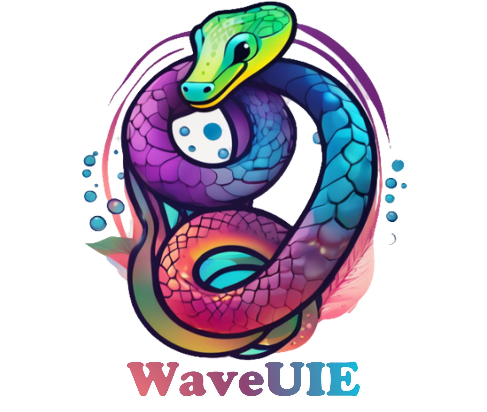

    

## WaveUIE: Policy-Driven Contrastive Learning for Underwater Image Enhancement in the Wavelet Domain

[Zhihao Chen](https://scholar.google.com/citations?user=SBoHvVQAAAAJ&hl=zh-CN), [Yiyuan Ge](https://scholar.google.com/citations?user=qKxpHGcAAAAJ&hl=zh-CN), [Ziyang Wang](https://scholar.google.com/citations?user=GWF20_wAAAAJ), [Xin Lin](https://scholar.google.com/citations?view_op=list_works&hl=en&hl=en&user=XpMnJ1QAAAAJ), [Lu Yang](https://scholar.google.com/citations?hl=zh-CN&user=V-6H56AAAAAJ)

> **Abstract:**  Underwater image enhancement remains challenging in computer vision due to its complex and diverse degradation phenomena. Existing state-of-the-art methods mainly focus on spatial domain modelling and demonstrate superiority, but they fall short in two key aspects: 1) underutilization of frequency domain features, and 2) insufficient exploitation of the relationship between the positive and negative samples during the training. To overcome these limitations, we propose a wavelet-driven framework called WaveUIE. Specifically, our method decomposes images into high/low-frequency components via the wavelet transform. To better mine the features of these two component patterns, a high-frequency enhancement block (HFEBlock) is introduced to restore fine textures of the high-frequency component. In addition, we also introduce a low-frequency enhancement block (LFEBlock) to effectively eliminates color casts and blur of the low-frequency features. Moreover, we design a dynamic frequency fusion block (DFFBlock), which orchestrates cross-frequency interactions by first calibrating high-frequency data with the enhanced low-frequency features, and then synthesising them into coherent visual outputs. Finally, we design a wavelet fine-grained contrastive policy (WFCPolicy) to decompose images into four sub-bands and impose contrastive constraints on the enhanced result (anchor) within the sub-band space. These constraints pull the anchor closer to the ground-truth (positive samples) while pushing it away from the original degraded image (negative samples), thereby explicitly leveraging the degradation features present in different frequency sub-bands to improve enhancement performance. Experimental evaluations demonstrate state-of-the-art performance across multiple benchmarks, with significant improvements in both SSIM and UIQM metrics over existing methods. Project webpage: https://1024ailab.github.io/MUIE/. 
> 

    

⭐If this work is helpful for you, please help star this repo. Thanks!🤗

## 📑 Contents

- [Visual Results](#visual_results)

## 🔍 Visual Results On Underwater Image Enhancement

  

  

## Contact

If you have any questions, feel free to approach me at 2021011561@bistu.edu.cn

