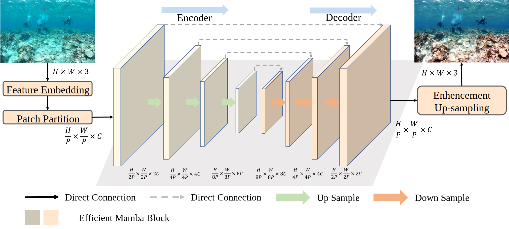
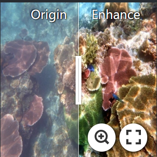

    

## MambaUIE: Unraveling the Ocean's Secrets with Only 2.8 GFLOPs

### [[Paper](https://arxiv.org/abs/2404.13884)] 

[Zhihao Chen](https://scholar.google.com/citations?user=SBoHvVQAAAAJ&hl=zh-CN), [Yiyuan Ge](https://scholar.google.com/citations?user=qKxpHGcAAAAJ&hl=zh-CN)

### [MambaUIE Preformance on Real World Video](https://www.youtube.com/watch?v=BtInjZjvevQ) 

> **Abstract:**  Underwater Image Enhancement (UIE) techniques aim to address the problem of underwater image degradation due to light absorption and scattering. In recent years, both Convolution Neural Network (CNN)-based and Transformer-based methods have been widely explored. In addition, combining CNN and Transformer can effectively combine global and local information for enhancement. However, this approach is still affected by the secondary complexity of the Transformer and cannot maximize the performance. Recently, the state-space model (SSM) based architecture Mamba has been proposed, which excels in modeling long distances while maintaining linear complexity. This paper explores the potential of this SSM-based model for UIE from both efficiency and effectiveness perspectives. However, the performance of directly applying Mamba is poor because local fine-grained features, which are crucial for image enhancement, cannot be fully utilized. Specifically, we customize the MambaUIE architecture for efficient UIE. Specifically, we introduce visual state space (VSS) blocks to capture global contextual information at the macro level while mining local information at the micro level. Also, for these two kinds of information, we propose a Dynamic Interaction Block (DIB) and Efficient Feedforward Network (EFFN) for intra-block feature aggregation. MambaUIE is able to efficiently synthesize global and local information and maintains a very small number of parameters with high accuracy. Experiments on UIEB datasets show that our method reduces GFLOPs by 67.4% (2.715G) relative to the SOTA method. To the best of our knowledge, this is the first UIE model constructed based on SSM that breaks the limitation of FLOPs on accuracy in UIE. The official repository of MambaUIE at https://github.com/1024AILab/MambaUIE. 
> 

    

    

⭐If this work is helpful for you, please help star this repo. Thanks!🤗

## 📑 Contents

- [Visual Results](#visual_results)

## 🔠Visual Results On Real-world Underwater Image

  

  

## Contact

If you have any questions, feel free to approach me at 2021011561@bistu.edu.cn

